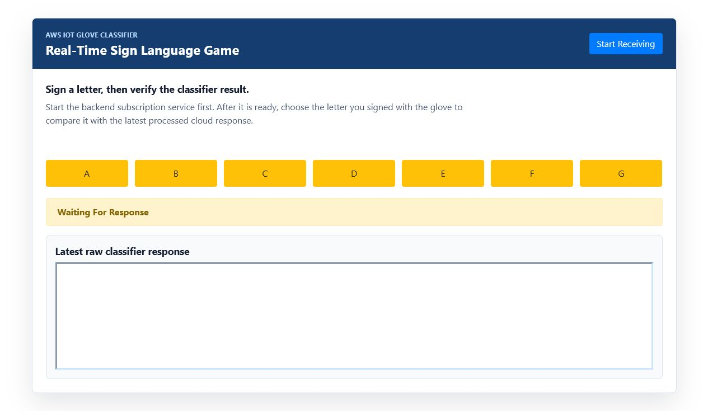

# Real-Time Glove Web App

This repository is a college assignment / practice project for a real-time sign-language glove demo. The project combines Raspberry Pi glove sensors, AWS IoT messaging, a Python machine-learning classifier, a Flask bridge, and a browser game UI that lets a user choose a signed letter and compare it with the latest classified glove response.

The repository now also contains unit-tested JavaScript code and a GitHub Actions pipeline for tests, quality scanning, security scanning, and dependency maintenance.



## What The Project Does

The intended demo flow is:

1. A sensor glove reads flex and IMU data from hardware attached to a Raspberry Pi.
2. The glove publishes processed sensor data to AWS IoT topics.
3. A cloud-side Python script trains and runs a random forest classifier for signed letters.
4. The web app starts a backend subscription service and asks the cloud classifier for a gesture result.
5. The browser UI reads the latest classified response from `web-app/public/hand_data.txt`.
6. The UI marks the selected letter as correct or incorrect.

In its current repository state, the most reliably runnable part is the Node/static web app and its unit-tested frontend/server behavior. The hardware, AWS IoT, and classifier scripts are preserved as assignment/demo code and require external credentials, device libraries, certificates, and training data that are not committed to the repo.

## Repository Layout

```text
.
├── glove/
│   ├── bno055_cal.dat
│   ├── cal_test.py
│   ├── collect_training_data.py
│   ├── demo1_glove.py
│   ├── demo2_glove.py
│   ├── demo3_glove.py
│   ├── get_avg_flex_val.py
│   ├── glove_start.py
│   └── glove_stop.py
├── learn/
│   ├── cloud_start.py
│   ├── demo_cloud.py
│   └── hyperparameter_optimization.py
├── web-app/
│   ├── backend/
│   │   ├── backend.py
│   │   └── backend_sub.py
│   ├── public/
│   │   ├── css/styles.css
│   │   ├── js/index.js
│   │   ├── hand_data.txt
│   │   └── index.html
│   ├── test/
│   │   ├── index.test.js
│   │   └── server.test.js
│   ├── package-lock.json
│   ├── package.json
│   └── server.js
├── .github/
│   ├── dependabot.yml
│   └── workflows/ci.yml
└── docs/images/sign-language-game-ui.png
```

## Main Components

### Glove Scripts

The `glove/` directory contains Raspberry Pi and sensor utilities:

- `demo3_glove.py` is the final glove demo script. It gathers and preprocesses glove data, subscribes to a control topic, and publishes data when commanded.
- `collect_training_data.py` collects sensor readings for classifier training.
- `cal_test.py` reads/writes BNO055 calibration data.
- `get_avg_flex_val.py` helps calculate flex sensor ranges.
- `glove_start.py` and `glove_stop.py` publish test control commands.

These scripts need Python 3, AWS IoT certificates/configuration, Raspberry Pi GPIO libraries, Adafruit sensor libraries, and physical glove hardware.

### Learning / Cloud Scripts

The `learn/` directory contains classifier and AWS IoT cloud-side scripts:

- `demo_cloud.py` trains/runs a random forest classifier and sends classified results toward the frontend through AWS IoT.
- `hyperparameter_optimization.py` searches classifier parameters for random forest and k-nearest neighbors models.
- `cloud_start.py` publishes a test cloud-control command.

These scripts need Python 3, scikit-learn, AWS IoT credentials, and training CSV files.

### Web App

The `web-app/` directory contains the tested browser-facing app:

- `server.js` serves the static UI with Express and exposes a `/health` endpoint for smoke checks.
- `public/index.html` is the game interface.
- `public/js/index.js` handles subscription, classifier request, response loading, and correct/incorrect UI states.
- `public/css/styles.css` contains the responsive UI styling.
- `backend/backend.py` and `backend/backend_sub.py` are Flask/AWS IoT bridge scripts from the original assignment.

## Setup

### Node Web App

```bash
cd web-app
npm install
```

The Node app uses:

- Node.js 22 for local tests and CI
- Express for serving static files
- dotenv for local environment loading

### Python / Hardware Side

Install only the packages needed for the scripts you intend to run:

```bash
pip install flask flask-cors AWSIoTPythonSDK scikit-learn
pip install adafruit-circuitpython-mcp3xxx gpiozero
```

The original BNO055 dependency used an older Adafruit library. Follow the BNO055 Raspberry Pi setup instructions appropriate for the hardware image you are using.

AWS IoT scripts include placeholder comments for host, certificate, private key, and root CA paths. Do not commit real AWS certificates or private keys.

## Build, Test, And Launch

Run all commands from `web-app/`.

### Build / Syntax Check

```bash
npm run build
```

This runs `node --check` on the server and browser JavaScript.

### Unit Tests With Coverage

```bash
npm test
```

This uses Node's built-in test runner and enforces at least 90% line coverage for:

- `web-app/server.js`
- `web-app/public/js/index.js`

Current local result:

```text
19 tests passing
94.96% line coverage
```

### Launch The Web UI

```bash
npm start
```

Then open:

```text
http://localhost:8080/
```

The static UI works without the Flask/AWS backend, but subscription/classification actions will show an error until the Flask bridge and AWS IoT services are configured and running.

### Launch The Flask Bridge

From `web-app/backend/`:

```bash
set FLASK_APP=backend.py
flask run
```

On macOS/Linux:

```bash
export FLASK_APP=backend.py
flask run
```

The browser UI expects this service at:

```text
http://127.0.0.1:5000/
```

### Run Cloud / Learning Scripts

From `learn/`:

```bash
python hyperparameter_optimization.py
python demo_cloud.py
```

### Run Glove Script

From the repository root or any directory with the correct path:

```bash
python glove/demo3_glove.py
```

## Unit-Tested Behavior

Tests live in `web-app/test/`.

The test suite covers:

- Express static serving for the game UI
- `/health` smoke endpoint
- server error handler responses
- start/stop behavior for the HTTP server
- browser handler exports used by `index.html`
- local Ajax success and failure behavior
- subscription success and error states
- cloud-start waiting and error states
- classifier response parsing
- correct and incorrect letter outcomes
- missing required DOM element errors

One fixed bug found while adding tests: the original code searched for the requested letter anywhere in the raw classifier text. That could mark `a` as correct simply because a word like `classified` contains `a`. The UI now matches the requested letter as a standalone token.

## GitHub Actions Pipeline

The pipeline is defined in `.github/workflows/ci.yml`.

It runs on:

- pushes to `main`
- pushes to `dev`
- pull requests targeting `main`
- pull requests targeting `dev`
- a weekly scheduled scan

### Unit Tests

The `Unit Tests` job:

- checks out the repository
- installs Node.js 22
- caches npm dependencies with `web-app/package-lock.json`
- runs `npm ci`
- runs `npm run build`
- runs `npm test` with the 90% line coverage gate

### Code Scanning / Quality

The `Code Scanning / Quality` job runs GitHub CodeQL default analysis for:

- JavaScript / TypeScript
- Python

Results are uploaded to GitHub Code Scanning with a quality category for each language.

### Code Scanning / Security

The `Code Scanning / Security` job runs:

- `npm audit --omit=dev` for production Node dependency vulnerabilities
- GitHub Dependency Review on pull requests, failing on high-or-worse vulnerable dependency changes
- CodeQL `security-extended` analysis for JavaScript / TypeScript and Python

CodeQL results are uploaded to GitHub Code Scanning with a security category for each language.

### Dependency Automation

Dependabot is configured in `.github/dependabot.yml` for:

- npm dependencies in `/web-app`
- GitHub Actions versions in `/.github/workflows`

Dependabot checks weekly and opens update PRs.

### GitHub Settings To Enable

For best results, enable these repository settings in GitHub:

- Dependency graph
- Dependabot alerts
- Dependabot security updates
- Code scanning alerts
- Secret scanning / push protection if available for the repository plan

GitHub documents CodeQL and dependency review as available for public repositories. Private repository availability can depend on GitHub plan and Code Security / Advanced Security settings.

## Improvements Made

- Replaced the failing placeholder npm test script with real unit tests.
- Added 90% line coverage enforcement.
- Refactored `server.js` so tests can import the Express app without binding a port.
- Added `/health` for CI and smoke checks.
- Removed unused vulnerable npm dependencies.
- Updated `package-lock.json`; `npm audit --omit=dev` now reports zero vulnerabilities.
- Refactored browser logic into testable functions while preserving global HTML handlers.
- Removed the jQuery runtime dependency by adding a tiny local Ajax helper.
- Improved classifier letter matching to avoid false positives.
- Restyled the UI into a responsive, documented interface.
- Added a screenshot of the UI to the README.
- Added GitHub Actions CI with unit tests, quality scanning, security scanning, dependency review, and weekly scheduled scans.
- Added Dependabot dependency automation.
